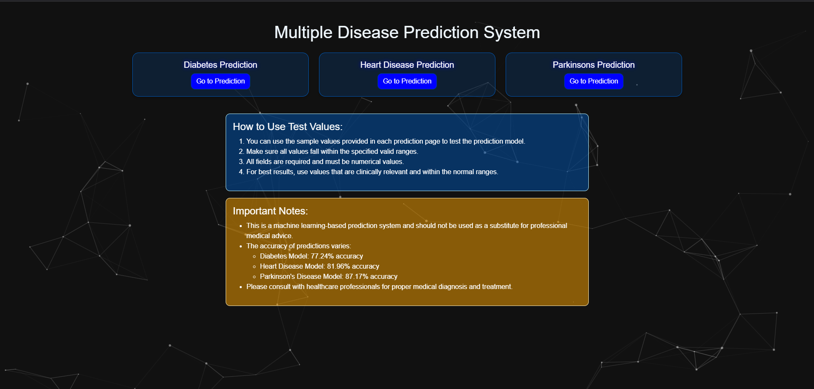
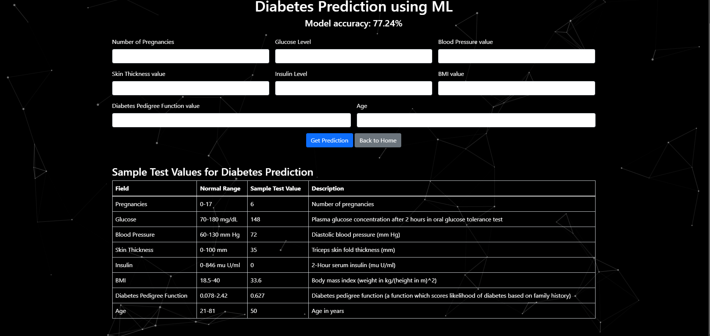

# **DIAGNOSIFY** 

Welcome to the **Disease Diagnosis WebApp**! This project leverages the power of **machine learning** to diagnose diseases based on user inputs. 🚀
**https://diagnosify-arb3.onrender.com**

## 🌟 Overview  

This web application can diagnose the following diseases:  
- **Diabetes**   
- **Parkinson’s Disease**  
- **Heart Disease**   

It uses **Support Vector Machines (SVM)**, a robust and efficient machine learning algorithm, to classify and predict diseases with impressive accuracy.  

---

## 📚 Datasets  

The datasets used for this project are included in the repository:  
- [Diabetes Dataset](diabetes.csv)  

**Parkinson’s Dataset**  
- [Parkinson’s Dataset](parkinsons.csv)  

**Heart Disease Dataset**  
- [Heart Disease Dataset](heart_disease_data.csv)  

These datasets were explored, cleaned, and analyzed to find correlations that helped build reliable machine learning models.  

---

## 🔄 Workflow  

1. **Data Exploration and Cleaning**  
   - Identified patterns and correlations in the datasets.  
   - Handled missing values and outliers to ensure the datasets were ready for modeling.  

2. **Model Training**  
   - Trained three machine learning models:  
     - **Random Forest**  
     - **Logistic Regression**  
     - **Support Vector Machine (SVM)**  
   - Selected the best-performing models (all **SVMs**) for the web application.  

3. **Web Application Development**  
   - Built an **interactive web application** to take user inputs (patient reports) and provide disease diagnoses.  
   - Integrated the trained SVM models for prediction.  

---

## 🧪 Model Performance  

| Disease        | Classifier | Accuracy (%) |  
|----------------|------------|--------------|  
| Diabetes       | SVM        | **77.27**    |  
| Parkinson’s    | SVM        | **87.19**    |  
| Heart Disease  | SVM        | **81.99**    |  

---

## 🖥️ How It Works  

1. **Input**: Users enter their medical report data into the app.  
2. **Diagnosis**: The app processes the input through the trained SVM models.  
3. **Output**: The app provides a diagnosis indicating whether the user has the disease or not.  

---

## 🖼️ Demonstration  
Explore Diagnosify on : **https://agamrampal1.pythonanywhere.com**

Here’s a screenshot showing the working of the **Diagnosify** Webapp:




---

## 🛠️ Technologies Used  

- **Machine Learning**: Random Forest, Logistic Regression, Support Vector Machine  
- **Backend**: Python   
- **Frontend**: Interactive web interface:HTML, CSS, Javascript
- **Datasets**: Publicly available medical datasets  

---

## 🚀 How to Run  

1. Clone the repository:  
```bash  
git clone https://github.com/agam25rpro/Diagnosify

